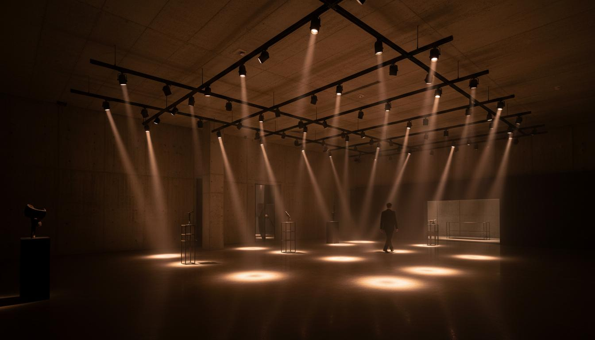

# ElectricEye

> **Premium Commercial LED Lighting Showcase**

A high-end, single-page product catalog website for showcasing commercial LED lighting solutions. Built with modern web technologies and featuring immersive 3D interactions, smooth scroll animations, and a premium architectural aesthetic.



## Overview

ElectricEye is a sophisticated lighting distribution platform that treats commercial luminaires as sculptural objects. The site features cinematic WebGL particle effects, a liquid-glass navigation system with 3D floating product previews, and a kinetic scroll-driven product gallery that creates a "shuffled deck" experience as users browse.

**Live Demo:** [https://electriceye-phi.vercel.app/](https://electriceye-phi.vercel.app/)

## Features

- **Cinematic Hero Section** — Full-viewport hero with Three.js atmospheric particle system (1,500 additive-blended particles) that respond to mouse movement
- **Liquid Glass Navigation** — Interactive category browser with a frosted glass pill that tracks the cursor and floating 3D product cards that tilt toward the mouse
- **Kinetic Product Gallery** — 16 product cards in a 4-column grid that undulate in 3D space using GSAP ScrollTrigger, creating a wave-like motion as you scroll
- **Comprehensive Product Catalog** — 10 lighting categories: LED Bulbs, Tube Lights, Surface Panels, Downlights, Pendants, Track Lights, Flood Lights, Strip Lights, Street Lights, and Accessories
- **Dealer Contact System** — Full inquiry form with 4 dealer locations across India (Mumbai, Delhi, Bangalore, Hyderabad) with direct phone/email links
- **Trade Account Application** — Dedicated section for architects, designers, and contractors to apply for exclusive pricing
- **Responsive Design** — Fully responsive across desktop, tablet, and mobile devices
- **Smooth Scrolling** — Lenis smooth scroll with lerp interpolation for buttery navigation
- **Premium Aesthetic** — Warm minimalist palette with charcoal, warm gray, and amber accent colors

## Tech Stack

| Technology | Purpose |
|------------|---------|
| [React 19](https://react.dev) | UI framework |
| [TypeScript](https://typescriptlang.org) | Type safety |
| [Vite](https://vitejs.dev) | Build tool & dev server |
| [Tailwind CSS](https://tailwindcss.com) | Utility-first styling |
| [shadcn/ui](https://ui.shadcn.com) | UI component primitives |
| [Three.js](https://threejs.org) | WebGL 3D rendering |
| [@react-three/fiber](https://docs.pmnd.rs/react-three-fiber) | React renderer for Three.js |
| [GSAP](https://greensock.com/gsap) | Animation engine & ScrollTrigger |
| [Lenis](https://lenis.studiofreight.com) | Smooth scroll |
| [Custom GLSL Shaders](https://www.khronos.org/opengl/wiki/Core_Language_(GLSL)) | Particle effects |

## Project Structure

```
ElectricEye/
  public/
    favicon.png                 # Site favicon
    images/
      hero-bg.jpg               # Hero section background
      product-1.jpg             # LED Downlight
      product-2.jpg             # Pendant Cylinder
      product-3.jpg             # Track Spotlight
      product-4.jpg             # Linear Batten
      product-5.jpg             # Surface Panel
      product-6.jpg             # Flood Light
      product-7.jpg             # LED Strip
      product-8.jpg             # Street Light
    videos/
      particle-texture.mp4      # Particle gradient texture
  src/
    components/
      AtmosphericParticles.tsx  # Three.js particle system
      KineticProductGrid.tsx    # 3D scroll-driven product grid
      LiquidGlassNavigation.tsx # Glass-morphism navigation
      Navigation.tsx            # Fixed header navigation
    sections/
      Hero.tsx                  # Hero section
      Featured.tsx              # Categories showcase
      Collection.tsx            # Product gallery
      Contact.tsx               # Dealer contact form
      Footer.tsx                # Site footer
    App.tsx                     # Root component with Lenis
    index.css                   # Global styles & Tailwind config
    main.tsx                    # Entry point
  index.html                    # HTML with meta tags
  package.json
  tailwind.config.js
  tsconfig.json
  vite.config.ts
```

## Getting Started

### Prerequisites

- [Node.js](https://nodejs.org) 20 or higher
- npm (comes with Node.js)

### Installation

1. Clone or download the project:
```bash
cd ElectricEye
```

2. Install dependencies:
```bash
npm install
```

3. Start the development server:
```bash
npm run dev
```

4. Open your browser and navigate to `http://localhost:5173/`

### Building for Production

```bash
npm run build
```

The production-ready files will be in the `dist/` directory.

## Core Effects

### Atmospheric Particles (Three.js)

A custom WebGL particle system using additive blending and video-based radial gradient textures. 1,500 particles drift organically and are repelled by the cursor. Built with custom GLSL vertex and fragment shaders.

**Key implementation:**
- `AdditiveBlending` with `depthWrite: false` for volumetric glow
- Video texture for soft particle falloff
- Mouse repulsion with distance-based force
- Per-particle color variation (warm white, amber, dark)

### Liquid Glass Navigation

A React + GSAP implementation of a frosted glass navigation bar. The glass pill physically tracks the hovered item with refraction-edge highlights.

**Key implementation:**
- `backdrop-filter: blur(12px) saturate(150%)` for glass effect
- Pseudo-element gradient edges simulating refraction
- GSAP tweening for smooth pill tracking
- Floating images with 3D perspective tilt toward cursor

### Kinetic Product Grid

A CSS grid driven by ScrollTrigger that undulates product cards in 3D space, creating a "deck" or "shuffled paper" effect based on scroll velocity.

**Key implementation:**
- `perspective: 1000px` and `transform-style: preserve-3d` on parent
- Column-based delay for wave pattern
- `rotationY`, `rotationX`, `rotationZ` transforms per card
- Counter-rotation on images to keep content upright

## Product Categories

| Category | Products | Description |
|----------|----------|-------------|
| LED Bulbs | 48+ | Energy-efficient retrofit solutions |
| Tube Lights | 36+ | Linear fluorescent replacements |
| Surface Panels | 24+ | Flush-mount ceiling systems |
| Downlights | 62+ | Recessed architectural lighting |
| Pendants | 18+ | Suspended cylinder luminaires |
| Track Lights | 30+ | Adjustable spotlight systems |
| Flood Lights | 20+ | High-power outdoor illumination |
| Strip Lights | 28+ | Flexible accent lighting |
| Street Lights | 15+ | Urban roadway luminaires |
| Accessories | 40+ | Drivers, dimmers & controls |

## Design Tokens

### Colors
| Token | Hex | Usage |
|-------|-----|-------|
| Warm Gray | `#ececec` | Primary background |
| Off White | `#f3f3f3` | Secondary background |
| Charcoal | `#1c1c1c` | Dark sections, text |
| Amber Glow | `#f2ae72` | Accent, highlights, CTAs |

### Typography
- **Primary Font:** Inter (Google Fonts)
- **Display:** 80-120px, weight 400, tracking -2px
- **Section Headers:** 48-64px, weight 500, tracking -1px
- **Body:** 18px, weight 300, line-height 1.6
- **Captions/Nav:** 14px, weight 400, uppercase, tracking 1px

## Browser Support

- Chrome 90+
- Firefox 88+
- Safari 14+
- Edge 90+

> **Note:** The liquid glass navigation relies on `backdrop-filter` support. Firefox users will see a semi-transparent fallback.

## Performance

- Tree-shaking and code splitting via Vite
- Optimized asset compression
- Cache-busting hashes on production builds
- Lazy-loaded Three.js canvas
- Efficient GSAP ScrollTrigger cleanup

## License

&copy; 2026 ElectricEye Lighting Pvt. Ltd. All rights reserved.

## Contact

For inquiries, partnerships, or support:
- **Email:** info@electriceye.in
- **Phone:** +91 22 2287 4500
- **Address:** Light Tower, 45 Marine Lines, Mumbai 400002

---

*Designed and built with precision &mdash; because light defines the space.*
